# Hi there, I'm Nguyễn Tấn Lộc 👋

  

  

## 🚀 About Me

- 🎓 I'm a final-year **Information Technology** student
- 💻 I’m passionate about web and software development, and I’m eager to expand my knowledge in Data and AI.
- 🔍 Always seeking to learn cutting-edge technologies
- 📫 How to reach me: **93.nguyentanloc2018@gmail.com**
- 👉 Visit my personal website: **[My Portfolio](https://roaring-pony-81aa43.netlify.app/)**

 

## 💭 Developer Quote

  

## 🛠️ Tech Stack

### 💻 Languages

### 🎨 Frontend

### ⚙️ Backend

### 🗄️ Database

### 🛠️ Tools & Technologies

## 📊 GitHub Metrics (tự động cập nhật)

<!--METRICS:START-->

  

<!--METRICS:END-->

*(bảng số liệu trên được GitHub Actions build lại mỗi ngày bằng script `scripts/generate-metrics.mjs`)*

## 🐍 Contribution Snake

  <picture>
    <source media="(prefers-color-scheme: dark)" srcset="https://raw.githubusercontent.com/Loc1909/Loc1909/output/github-contribution-grid-snake-dark.svg" />
    <source media="(prefers-color-scheme: light)" srcset="https://raw.githubusercontent.com/Loc1909/Loc1909/output/github-contribution-grid-snake.svg" />
    
  </picture>

## 📊 GitHub Stats

  

## 📈 Activity Graph

  

## 🤝 Connect with Me

  

---

  
  
  
  
  **✨ "Code is like humor. When you have to explain it, it's bad." - Cory House ✨**
  
  

